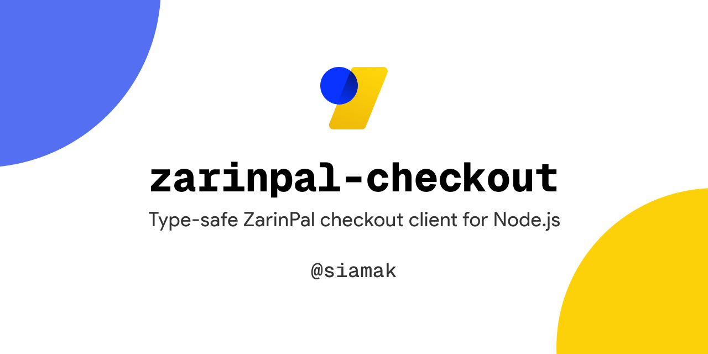

# zarinpal-checkout

A modern, type-safe ZarinPal checkout client for Node.js. This `1.0.0` release keeps backward-compatible method names while upgrading internals, tooling, and tests.



[](https://www.npmjs.com/package/zarinpal-checkout)
[](https://www.npmjs.com/package/zarinpal-checkout)
[](https://github.com/siamak/zarinpal-checkout/actions/workflows/ci.yml)
[](https://github.com/siamak/zarinpal-checkout/wiki)
[](https://opensource.org/licenses/MIT)
[](https://www.typescriptlang.org/)

## Features

- ✅ TypeScript-first with bundled type definitions
- ✅ Backward-compatible APIs (`create`, `PaymentRequest`, `PaymentVerification`, `UnverifiedTransactions`, `RefreshAuthority`, `TokenBeautifier`)
- ✅ Options-based client creation with `createWithOptions`
- ✅ Sandbox and production mode support
- ✅ Currency support for `IRR` and `IRT`
- ✅ Configurable request timeout handling
- ✅ Fast built-in Node.js test runner
- ✅ Strict linting + type-checking workflows
- ✅ Rollup build output (ESM + CJS) with declaration bundling
- ✅ Ready-to-run examples for all public methods

## Installation

```bash
# npm
npm install zarinpal-checkout

# yarn
yarn add zarinpal-checkout

# pnpm
pnpm add zarinpal-checkout
```

## Usage

Official ZarinPal documentation: [https://www.zarinpal.com/docs/](https://www.zarinpal.com/docs/)
Project wiki: [https://github.com/siamak/zarinpal-checkout/wiki](https://github.com/siamak/zarinpal-checkout/wiki)

### Express Example App

If you want a ready-to-run Express integration using this package, see:

- Repository: [zarinpal-express-checkout](https://github.com/siamak/zarinpal-express-checkout/blob/main/README.md)
- Raw README: [https://github.com/siamak/zarinpal-express-checkout/raw/refs/heads/main/README.md](https://github.com/siamak/zarinpal-express-checkout/raw/refs/heads/main/README.md)

### Backward-compatible API (recommended for existing users)

```ts
import ZarinpalCheckout from 'zarinpal-checkout';

const zarinpal = ZarinpalCheckout.create(
  'xxxxxxxx-xxxx-xxxx-xxxx-xxxxxxxxxxxx',
  false,
  'IRT'
);

const request = await zarinpal.PaymentRequest({
  Amount: 1000,
  CallbackURL: 'https://example.com/payment/callback',
  Description: 'Order #123',
  Email: 'user@example.com',
  Mobile: '09120000000'
});

console.log(request.url);
```

### Options-based API

```ts
import { createWithOptions } from 'zarinpal-checkout';

const zarinpal = createWithOptions('xxxxxxxx-xxxx-xxxx-xxxx-xxxxxxxxxxxx', {
  sandbox: true,
  currency: 'IRR',
  timeoutMs: 8000
});
```


## Examples

The `examples/` directory includes runnable examples for every public method:

- `examples/create-client.ts`
- `examples/payment-request.ts`
- `examples/payment-verification.ts`
- `examples/unverified-transactions.ts`
- `examples/refresh-authority.ts`
- `examples/token-beautifier.ts`

Run with your preferred TypeScript runtime (for example `tsx` or `ts-node`) after replacing the merchant ID and callback URLs.

## API Reference

### `PaymentRequest(input)`
Creates a payment authority.

### `PaymentVerification(input)`
Verifies a completed payment authority.

### `UnverifiedTransactions()`
Fetches unverified authorities.

### `RefreshAuthority(input)`
Refreshes an existing authority expiration.

### `TokenBeautifier(token)`
Preserves previous token beautifier behavior.

## Development

```bash
# npm
npm install && npm run lint && npm run typecheck && npm test && npm run build

```

## Author

- Siamak Mokhtari

## License

MIT
